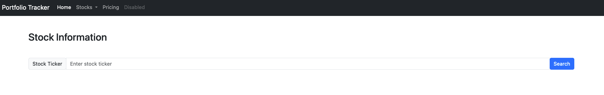
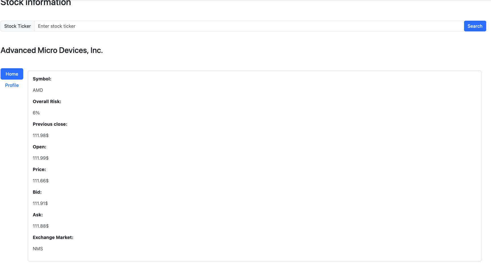
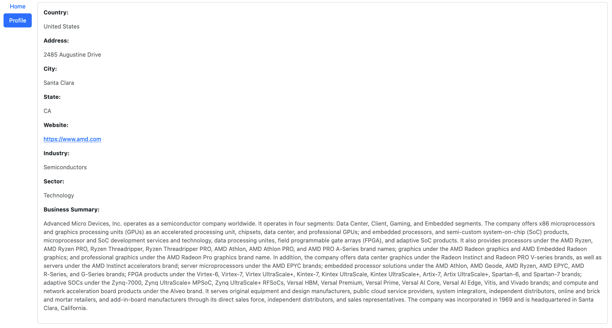
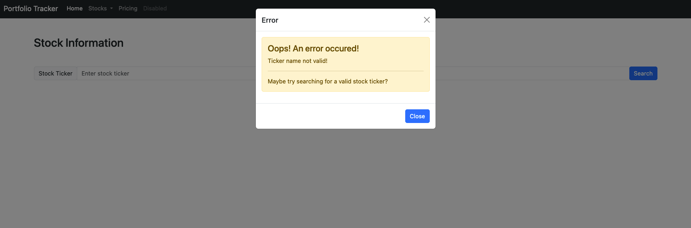
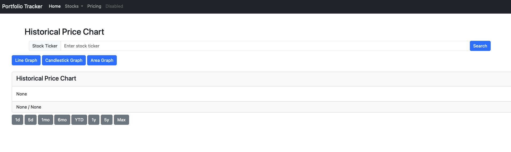
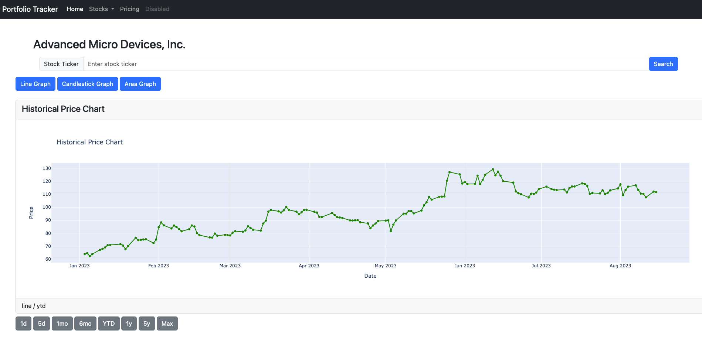
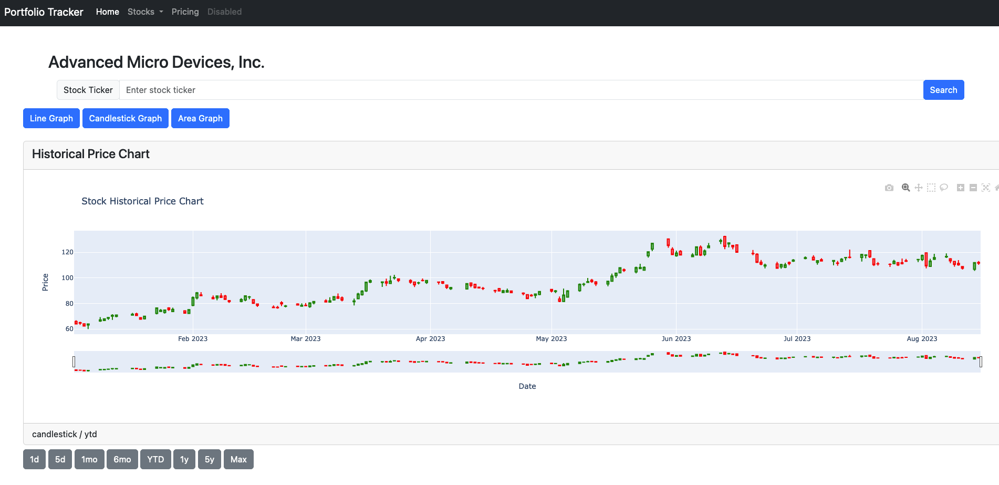
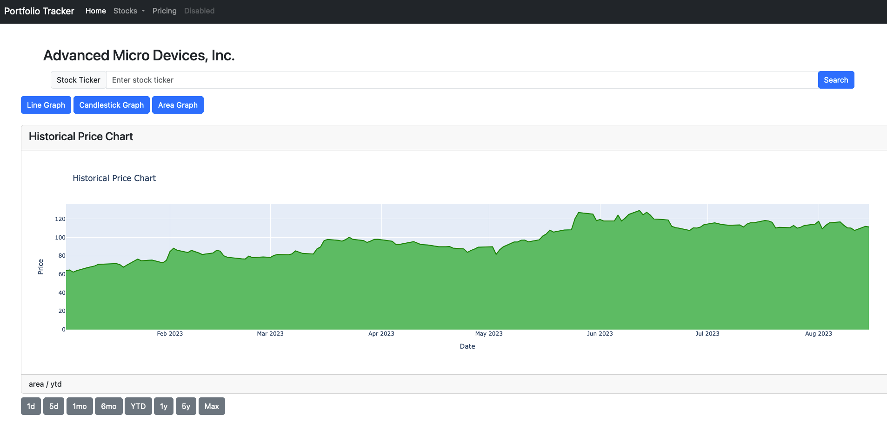

# Django Web Apps

## Description
This repository contains my django web apps that I developed or am developing during my freetime.
Currently I'm designing an investments portfolio tracker with Django using yfinance API. 
My other project is a flight tracking web app but due to recent policy changes regarding the tracking API, I'm not able to afford it.

## Features

**Investments Portfolio Tracker**
Regarding my investments portfolio, this web app will consist in the following modules:

- Search for stock information using ticker symbols.
- Display historical price charts with different graph types (line or candlestick).
- - Select different timeframes for the historical data.
- User account, where an user can create its own account and add its own investments to track the perfomance.
- Register transactions, where an user can register `BUY` or `SELL` actions to calculate profits or losses.
- TBD

## Technologies Used

- Django: Web framework for the backend.
- Plotly: Library for interactive data visualization.
- Yahoo Finance API: Used to fetch stock data.
- Animate.css: CSS animation library.
- Bootstrap: CSS framework for styling.

## Setup and Installation

How to setup and install this project:

1. Clone this repository to your local machine.
2. Create a virtual environment and install the required packages using `pip install -r requirements.txt`.
3. Create the database migration for the apps by running `python manage.py makemigrations <app_name>`, make sure to replace with the actual app name.
4. Set up the database by running `python manage.py migrate`. 
5. Start the development server with `python manage.py runserver`.

## Usage

TBD

## Screenshots

> Homepage of the Stocks app

> Stocks info page

> 
> 
>  

> Historical stocks price graph page

> 
> 
> 